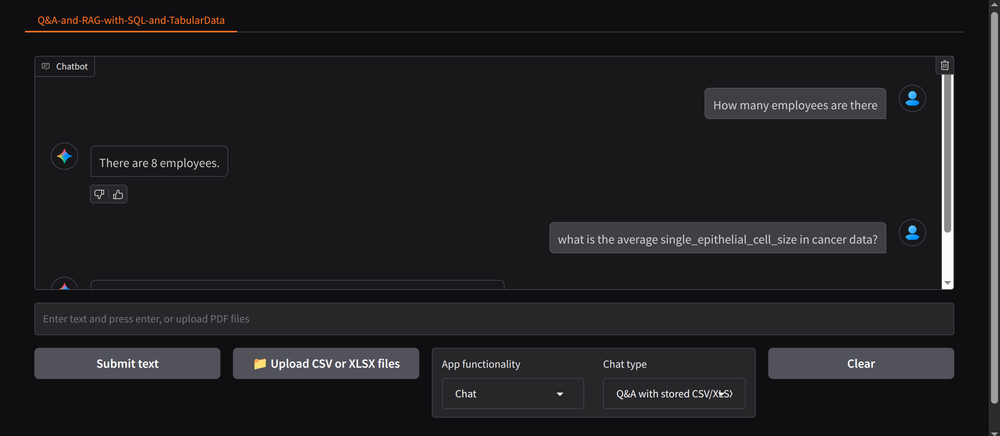

## Multisource Data Chatbot

It is an interactive **AI-powered** assistant designed to let you explore, analyze, and query your structured data—whether it’s stored in SQL databases, CSV, or Excel (XLSX) files—using simple natural language.

The chatbot combines the power of Large Language Models (**LLMs**) with advanced data retrieval techniques:
- It can translate your questions into SQL queries to fetch precise answers from databases.
- It can treat CSV/XLSX files as SQL databases, letting you ask questions about your spreadsheets as if they were SQL tables.
- For more complex or open-ended questions, it uses Retrieval-Augmented Generation (**RAG**) with vector search (**ChromaDB + spaCy embeddings**) to find and summarize relevant information from your tabular data.

The system features a modern web interface (built with **Gradio**) where you can chat, upload new files, and get instant insights from your data.

---

### How it works:
You ask a question (e.g., “What’s the average age in my dataset?” or “Show me all employees in the sales department.”)

The chatbot decides whether to use **SQL**, **CSV/XLSX**, or **vector search** based on your data and question.
It runs the query or search and returns a clear, human-readable answer—often with the relevant data snippet.

---

## 🖥️ User Interface



A modern, responsive chat interface supporting text input, file uploads, and real-time feedback.

---

## 📂 Project Structure
```bash
configs/ # Application configuration (YAML)
data/ # Data storage: SQL DBs, CSV/XLSX files, ChromaDB, uploads
explore/ # Jupyter notebooks and markdown for exploration and testing
images/ # UI and system images 
src/ # Main application and utility scripts
└── utils/ # Core logic: chatbot, file processing, config, etc.
```


---

## 🚀 Getting Started

### 1. Installation

```bash
git clone <your-repo-url>
cd Multisource_Data_Chatbot
python3 -m venv venv
source venv/bin/activate
pip install -r requirements.txt
sudo apt update && sudo apt install sqlite3
```

### 2. Configuration

- Edit `configs/app_config.yml` to set data directories and LLM settings.
- Set your API keys (e.g., OpenAI, Google) in a `.env` file.

### 3. Preparing Data

- **SQL DB from .sql file:**
  1. Place your `.sql` file in `data/sql/`
  2. Run:
     ```bash
     sqlite3 data/sqldb.db
     .read data/sql/your_database.sql
     ```
- **SQL DB from CSV/XLSX:**
  1. Place files in `data/csv_xlsx/`
  2. Run:
     ```bash
     python src/prepare_csv_xlsx_sqlitedb.py
     ```
- **Vector DB from CSV/XLSX:**
  1. Place files in `data/for_upload/`
  2. Run:
     ```bash
     python src/prepare_csv_xlsx_vectordb.py
     ```

### 4. Running the App

```bash
python src/app.py
```
- Open the Gradio UI in your browser (URL will be shown in the terminal).

---

## 💬 Usage

- **Chat with stored SQL DB:** Ask questions about your SQL database.
- **Chat with stored CSV/XLSX:** Query your tabular data as if it were a database.
- **RAG with ChromaDB:** Use semantic search for advanced Q&A.
- **Upload files:** Instantly chat with your own CSV/XLSX files.

---

## 📊 Example Data

Sample datasets are included in `data/csv_xlsx/` and `data/for_upload/`:
- `cancer.csv`, `diabetes.csv`, `titanic.csv`, `titanic_small.csv`

---

## 🧩 Core Components

- **`src/app.py`**: Main Gradio app and UI logic.
- **`src/utils/chatbot.py`**: Handles all chat logic, including SQL, CSV/XLSX, and RAG.
- **`src/utils/prepare_sqlitedb_from_csv_xlsx.py`**: Converts tabular files to SQLite DB.
- **`src/utils/prepare_vectordb_from_csv_xlsx.py`**: Converts tabular files to ChromaDB vector store.
- **`src/utils/upload_file.py`**: Handles file uploads and dynamic DB creation.
- **`src/utils/load_config.py`**: Loads and manages all configuration and environment variables.
- **`src/utils/ui_settings.py`**: UI feedback and toggling logic.
- **`src/utils/extract_sql_query.py`**: Cleans and extracts SQL queries from LLM output.

---

## 📒 Notebooks & Exploration

See the `explore/` directory for Jupyter notebooks demonstrating:
- SQL and CSV/XLSX Q&A
- RAG with tabular data
- Database connection tests

---

## ⚙️ System Requirements

- **OS:** Linux (tested on Ubuntu 6.14.0-24-generic) or Windows
- **Python:** 3.9+ (tested with Python 3.12)
- **Memory:** Minimum 8GB RAM (16GB recommended for large databases)

---

## 🛠️ Troubleshooting

- **spaCy Model:**  
  If you encounter errors with embeddings, ensure the spaCy model is installed:
  ```bash
  python -m spacy download en_core_web_md
  ```
- **Database Issues:**  
  Ensure your `.sql` or CSV/XLSX files are correctly formatted and placed in the right directory.
- **API Keys:**  
  Make sure all required API keys are set in your `.env` file.
- **ChromaDB Permissions:**  
  Verify you have write permissions for the `data/chroma/` directory.

---

## 📈 Performance Tips

- For large datasets, monitor RAM usage and consider chunking data.
- Optimize embedding and retrieval parameters for faster response times.
- Use appropriate LLM and embedding models for your use case.

---

## 🤝 Contributing

1. Fork the repository
2. Create a feature branch
3. Make your changes
4. Add tests if applicable
5. Submit a pull request

---

## 👏 Acknowledgments

- [LangChain](https://python.langchain.com/)
- [ChromaDB](https://www.trychroma.com/)
- [Gradio](https://www.gradio.app/)
- [Google](https://aistudio.google.com/apikey/)
- [spaCy](https://spacy.io/)

---

**Note:** This project is a reference implementation for building LLM-powered data chatbots. Ensure compliance with data privacy regulations when deploying with sensitive data.
